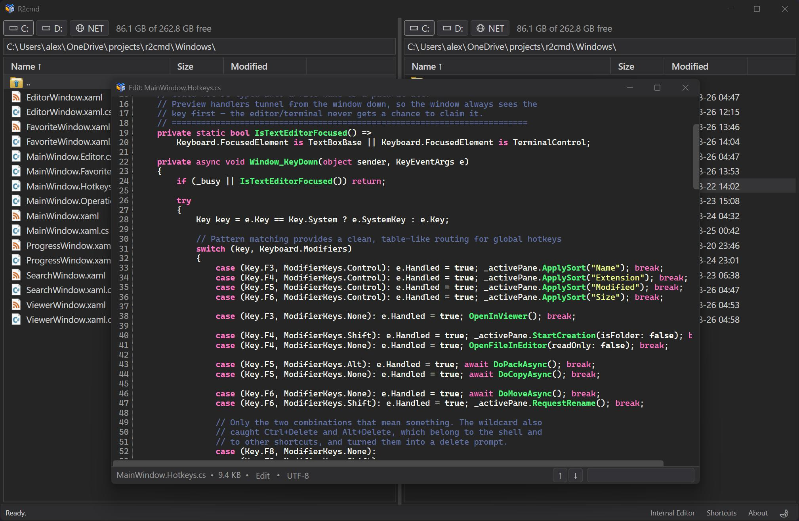
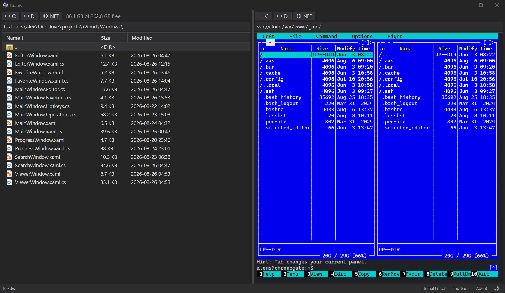
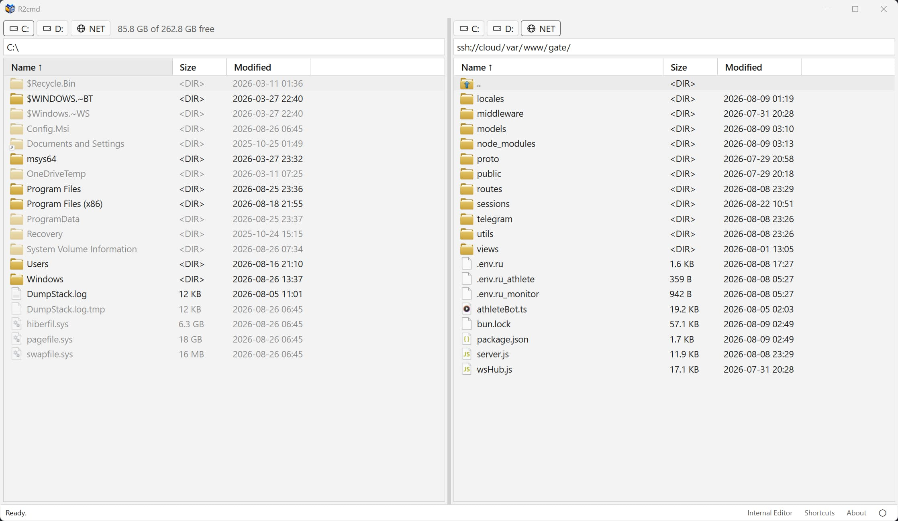

# R2Cmd — Fast Dual-Pane File Manager for Windows

[](LICENSE)
[](https://www.microsoft.com/windows)
[](https://dotnet.microsoft.com/)
[](CONTRIBUTING.md)

A fast, lightweight dual-pane file manager for Windows built with WPF and .NET 8.
Designed around minimalism — only what's necessary, nothing extra.
Optimized for performance, keyboard efficiency, and seamless remote workflows.
Ships as a single portable executable with built-in SSH/SFTP support.

---

<p align="center">
  
</p>

<p align="center">
  
</p>

<p align="center">
  
</p>

_Dual-pane interface with local file system and SSH remote server_

**About the name.** R2Cmd originally started as a specialized file manager for [Cloudflare R2](https://www.cloudflare.com/developer-platform/r2/) object storage. As the project grew, it evolved into a general-purpose dual-pane file manager with SSH, local filesystem, and archive support — but the name stuck. The "Cmd" suffix honors the classic commander-style file managers (Norton Commander, Midnight Commander) that inspired its keyboard-first design.

---

## ✨ Features

- **📦 Single-File Portable** — ~100 MB self-contained executable, no installation required
- **💻 Integrated Terminal** — Local (CMD/PowerShell) and SSH sessions with split view
- **🌐 SSH/SFTP Integration** — Browse remote servers via `ssh://` paths with connection pooling
- **🔍 Advanced Search** — Multi-mask, selected items, content search; fast SSH via `find`/`rg`
- **💻 Integrated Terminal** — Local and SSH sessions, MC mouse support, split/full layout
- **📝 Remote File Viewing** — Open remote files as temporary local copies in your editor
- **🖥️ Windows Shell Integration** — Native context menus, Recycle Bin, USB detection, symlinks
- **⚡ Non-Blocking Operations** — Multithreaded copy/move/zip with real-time progress
- **🎯 Keyboard-First** — Optimized shortcuts for power users
- **🎨 Dual Themes** — Light and dark mode with Windows 11 title bar integration
- **🖱️ Drag-and-Drop** — Between local and remote panes
- **📂 Quick Search** — Type-to-filter in current directory
- **⭐ Favorites** — Save frequently used paths with `Ctrl+D`

---

## 🚀 Quick Start

### Download

Get the latest release from [Releases page](https://github.com/axmsrn/R2Cmd/releases). Unpack and run `R2Cmd.exe` — no installation needed.

### Build from Source

**Prerequisites:** Windows 10/11 x64, [.NET 8.0 SDK](https://dotnet.microsoft.com/download), Git

```powershell
git clone https://github.com/axmsrn/R2Cmd.git
cd R2Cmd

# Debug
dotnet build -c Debug

# Release (single-file portable)
dotnet publish -c Release -r win-x64 --self-contained `
  -p:PublishSingleFile=true `
  -p:IncludeNativeLibrariesForSelfExtract=true `
  -p:EnableCompressionInSingleFile=true `
  -o publish\

```

Output: `publish\R2Cmd.exe`

---

## ⚙️ Configuration

Settings are stored in `%APPDATA%\R2Cmd\settings.json`.

Key options:

- **IsDarkTheme** — `true` / `false`
- **UseSystemIcons** — Use Windows shell icons
- **EditorPath** — Path to your text editor (Notepad++, Notepad3, VS Code, etc.)
- **SshSessions** — Saved SSH connections
- **Favorites** — Saved directory paths

There is also a built-in editor.

---

## 🛣️ Roadmap

- [ ] Multi-tab support within each pane
- [ ] Built-in file viewer with syntax highlighting
- [ ] FTP/FTPS support
- [ ] Archive preview (7z, RAR, TAR)

See [GitHub Issues](https://github.com/axmsrn/R2Cmd/issues) for full tracking.

---

## 🤝 Contributing

Contributions are welcome! See [CONTRIBUTING.md](CONTRIBUTING.md) for details.

**Quick start:**

1. Fork the repo
2. Create a branch (`feature/name` or `fix/issue-number`)
3. Make your changes, test thoroughly
4. Submit a Pull Request

**Ways to help:** report bugs, suggest features, submit code, improve docs.

---

## 💖 Support the Project

R2Cmd is built on a minimalist philosophy — only what's necessary, nothing extra. If that resonates with you, here's how to help:

- ⭐ **Star the repository** — helps others discover the project
- 🐛 **Report bugs** — keeps the project lean and reliable
- 💡 **Suggest features** — but only the truly useful ones
- ☕ **[Support on Boosty](https://boosty.to/axmsrn)** — optional donations

Your support helps maintain and improve R2Cmd.

---

## 📄 License

This software is provided for personal, educational, and non-commercial use only.

You are free to use, modify, and distribute this software for non-commercial purposes. **Commercial use, including integrating the software into commercial products or selling it, is strictly prohibited** without explicit permission from the author.

See the [LICENSE](LICENSE) file for full details.

---

## 📞 Contact

- **Repository**: [github.com/axmsrn/R2Cmd](https://github.com/axmsrn/R2Cmd)
- **Issues**: [GitHub Issues](https://github.com/axmsrn/R2Cmd/issues)
- **Email**: axmsrn@gmail.com

---

**Made with ❤️ for power users who value efficiency and control.**
